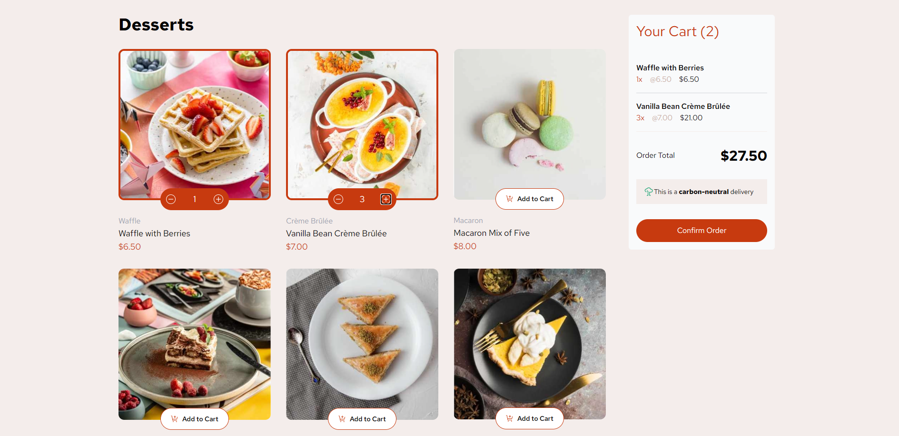
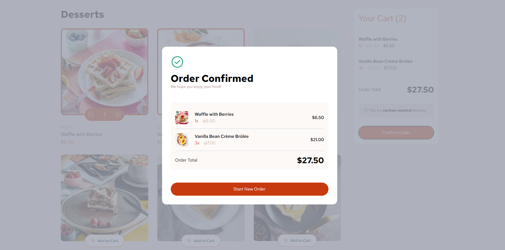
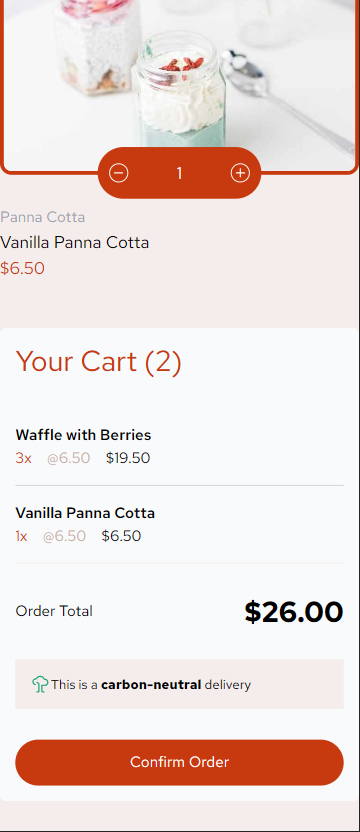
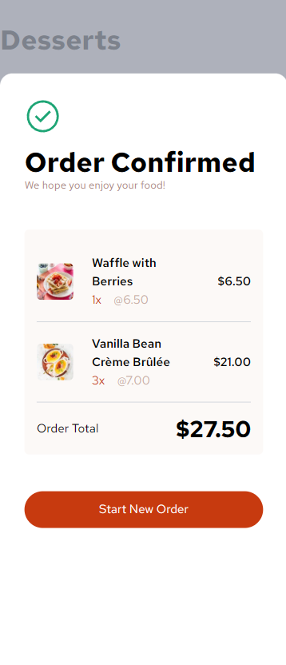

# Frontend Mentor - Product list with cart solution

This is a solution to the [Product list with cart challenge on Frontend Mentor](https://www.frontendmentor.io/challenges/product-list-with-cart-5MmqLVAp_d). Frontend Mentor challenges help you improve your coding skills by building realistic projects. 

## Table of contents

- [Frontend Mentor - Product list with cart solution](#frontend-mentor---product-list-with-cart-solution)
  - [Table of contents](#table-of-contents)
  - [Overview](#overview)
    - [The challenge](#the-challenge)
    - [Screenshot](#screenshot)
    - [Links](#links)
  - [My process](#my-process)
    - [Built with](#built-with)
    - [What I learned](#what-i-learned)
    - [Continued development](#continued-development)
    - [Useful resources](#useful-resources)
  - [Author](#author)

**Note: Delete this note and update the table of contents based on what sections you keep.**

## Overview

### The challenge

Users should be able to:

- Add items to the cart and remove them
- Increase/decrease the number of items in the cart
- See an order confirmation modal when they click "Confirm Order"
- Reset their selections when they click "Start New Order"
- View the optimal layout for the interface depending on their device's screen size
- See hover and focus states for all interactive elements on the page

### Screenshot

### Links

- Solution URL: [Github](https://github.com/es-sayers/product_list_with_cart)
- Live Site URL: [Add live site URL here](https://your-live-site-url.com)

## My process

I used NextJS with a mobile first approach. First thing was breaking down the page into components, then I focused on layout and responsiveness to start before moving on to styling.

### Built with

- Tailwind
- Mobile-first workflow
- [React](https://reactjs.org/) - JS library
- [Next.js](https://nextjs.org/) - React framework

### What I learned

This project taught me a lot about TypeScript and React. I learned how to better approach components, use contexts, create custom types, and improved my CSS.

### Continued development

I want to continue to learn how to create scalable applications with React. Contexts made this project so much easier so I want to improve my usage of them.

CSS is always something that I want to continue to practice so I avoid adding useless styles and can make my components as simple as possible.

### Useful resources

- [Tailwind](https://tailwindcss.com/) - They have great docs and it makes it very easy to pick up. 

## Author

- Frontend Mentor - [@es-sayers](https://www.frontendmentor.io/profile/es-sayers)
- Github - [@es-sayers](https://github.com/es-sayers)